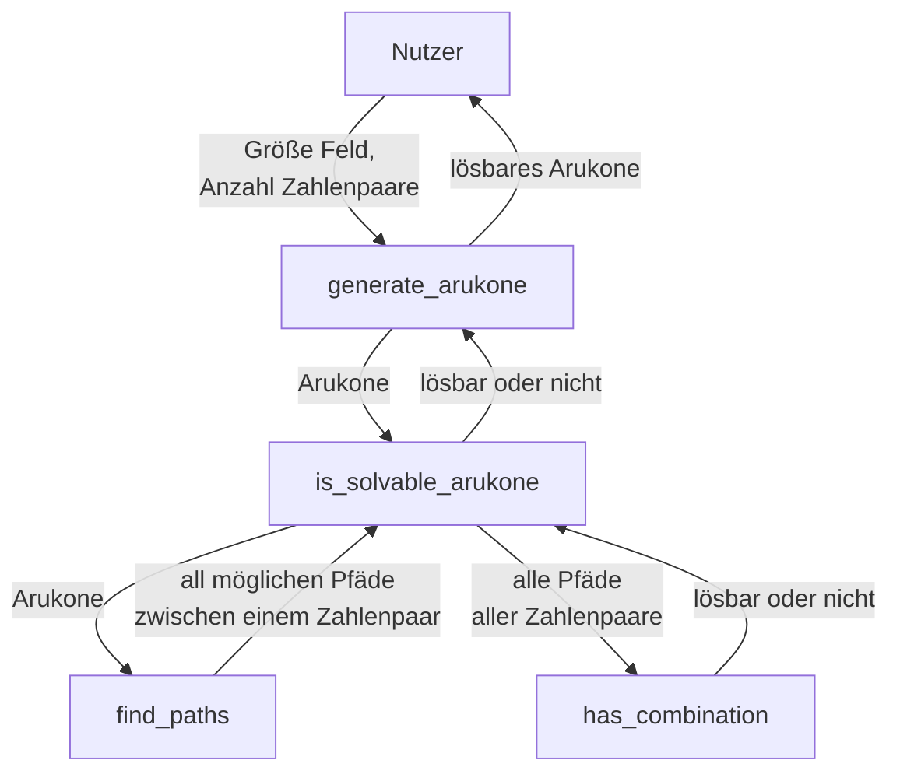
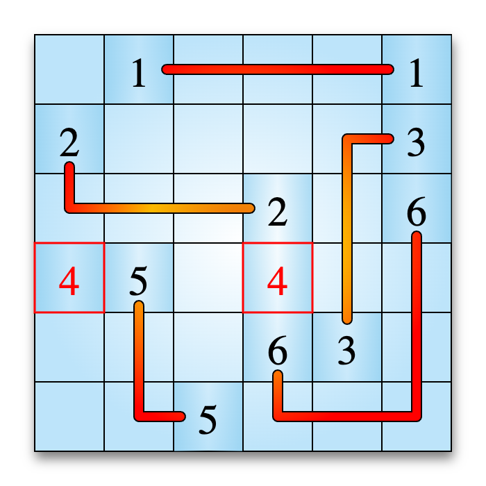
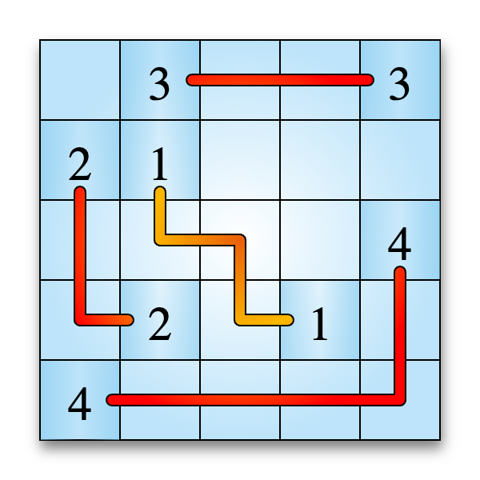

# Arukone

**Team-ID:** ==XYZ== <br>
**Autor:** Jonas B <br>
**Datum:** 26. Oktober 2023

## Inhaltsverzeichnis

1. [Lösungsidee](#lösungsidee)
2. [Umsetzung](#umsetzung)
3. [Beispiele](#beispiele)
4. [Quelltext](#quelltext)

## Lösungsidee

Das Programm erstellt zufällig aufgebaute Arukino-Puzzel. Danach überprüft es, ob das Arukino lösbar ist. Der Prozess wird so lange wiederholt, bis ein lösbares Arukino-Puzzel entsteht und es ausgegeben wird.

## Umsetzung

Die Lösungsidee wird in Python implementiert.


*Flowchart des Programms. Helferfunktionen wurden ausgelassen*

Beim Ausführen der Datei `generate.py` wird der Nutzer zuerst nach der Größe des Feldes und der Anzahl an Zahlenpaaren gefragt. Danach wird die Funktion `generate_arukone` aufgerufen.

Sie erstellt ein Feld und platziert die Ziffern an zufälligen Stellen. Um zu überprüfen, ob das generierte Spielfeld lösbar ist, ruft sie die Funktion `is_solvable_arukone` auf. Falls das Arukone nicht lösbar ist, generiert sie ein neues Arukone.

Die Funktion `is_solvable_arukone` überprüft,  ob ein Arukone lösbar ist. Dafür iteriert sie über jedes Zahlenpaar und findet die Position des ersten Auftretens des Paares. Danach sammelt sie die Ergebnisse der Funktion `find_paths` aus `solve.py` für das Zahlenpaar in der Variable `all_paths`.

Die rekursive Funktion `find_paths` findet alle Wege von einer Ziffer zu der dazugehörigen anderen Ziffer und sammelt sie in einer Liste. Jedes mal, dass die Funktion sich selbst aufruft, wird ein Pfad um einen Block verlängert, bis er schließlich das Ziel erreicht.

Nachdem `is_solvable_arukone` all Wege zwischen einem Paar für alle Paare erhält, ruft sie die Funktion `has_path_combination`, auch aus `solve.py`, auf.

Die Funktion `has_path_combination` überprüft, ob es eine Kombination der Pfäde gibt, bei der kein Element mehr als einmal vorkommt. Wenn ein Element häufiger vorkommt, kreuzen sich zwei Wege, was nicht erlaubt ist.

Falls sein Ergebniss True ist, ergibt auch `is_solvable_arukone` True und das Arukino wird ausgegeben.

## Beispiele

### Nutzung des Programms in der Konsole:

```
user@computer Bundeswettbewerb Informatik % python3 generate.py
Field size: 6
Number of pairs: 6
0 0 0 4 0 0
0 3 0 0 0 4
0 0 0 2 0 1
0 0 0 0 5 0
0 3 0 0 6 0
1 2 0 6 5 0
```

### Beispiel eines generierten Arukones, das nicht vom [Arukone-Checker](https://www.arukone.bwinf.de/arukone) gelöst werden konnte:



*Ausgabe des Arukone-Checkers für ein 6x6 Arukone mit 6 Paaren*

### Beispiel eines generierten Arukones, das vom [Arukone-Checker](https://www.arukone.bwinf.de/arukone) gelöst werden konnte:



*Ausgabe des Arukone-Checkers für ein 5x5 Arukone mit 4 Paaren*

## Quelltext

Der Quelltext besteht aus drei Dateien:

### generate.py

- `find_first_occurrence(arr: list, target: any) -> tuple` — Findet das erste Vorkommen eines Zielelements in einer Liste.
- `is_solvable_arukone(arukone: list, pairs: int) -> bool` — Prüft, ob eine Arukone lösbar ist.
- `generate_arukone(field_size: int, pairs: int) -> list` — Erstellt ein lösbares Arukone

### solve.py

- `find_paths(arukone: list, original_path: list) -> list` — Findet rekursiv alle Pfade, die von dem einen zu dem anderen Auftreten einer Zahl führen.
- `has_path_combination(all_paths: list, existing_path_combination: list = [], index: int = 0) -> bool` — Überprüft, ob es eine gültige Kombination von Pfaden gibt, bei der jedes Zahlenpaar verbunden ist.

### utility.py

- `get_surrounding_elements(arr: list, row: int, col: int) -> list` — Ermittelt die Elemente, die sich in einer 2D-Liste neben einem Element befinden.
