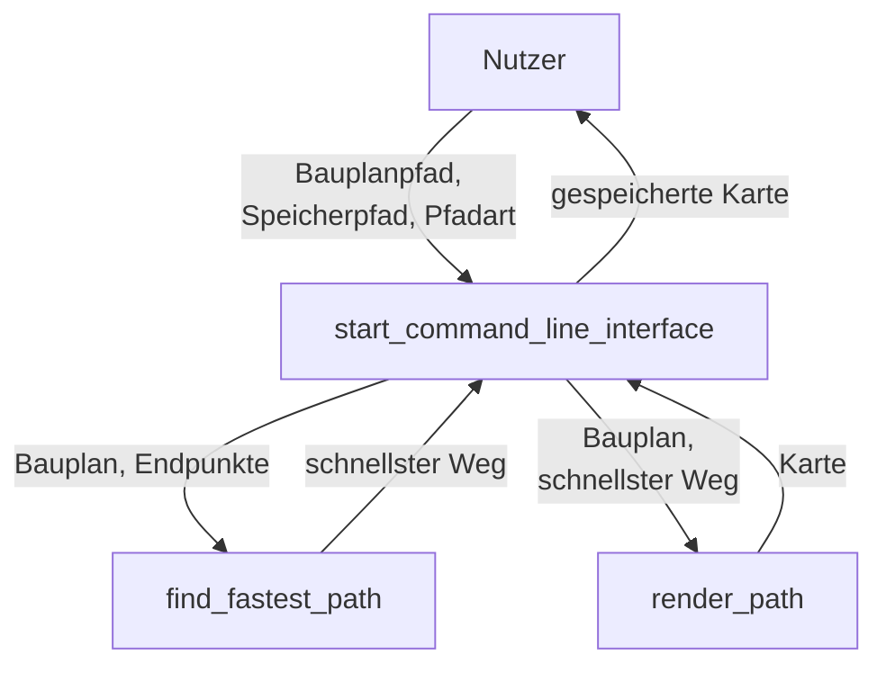

# Zauberschule

**Team-ID:** ==XYZ==  
**Autor:** Jonas B  
**Datum:** 2. November 2023

## Inhaltsverzeichnis

1. [Lösungsidee](#lösungsidee)
2. [Umsetzung](#umsetzung)
3. [Beispiele](#beispiele)
4. [Quelltext](#quelltext)

## Lösungsidee

Das Programm soll den schnellsten Weg in einem dreidemensionalen Raum finden. 

Dafür können alle Pfäde immer ein Feld in alle Richtungen (oben, unten, vor, zurück, links, rechts) verlängert werden, wobei einer der Endpunkte das erste Element darstellt. Dabei muss darauf geachtet werden, dass es dreimal so lange dauert, die Etage zu wechseln, wie auf einer Etage zu bleiben.

Wenn der zweite Endpunkt erreicht wird, ist der schnellste Pfad erreicht. Der Pfad dann noch auf dem Bauplan dargestellt und wiedergegeben werden.

## Umsetzung

Die Lösungsidee wird in Python implementiert.

*Flowchart des Programms. Helferfunktionen wurden ausgelassen*

Beim Ausführen der Datei `main.py` läuft die Funktion `start_command_line_interface`. Sie fragt den Nutzer nach dem Pfad des Bauplans, wo der Weg gespeichert werden soll und wie der Weg dargestellt werden soll. Es gibt zwei Arten der Darstellung: entweder mit Symbolen wie auf der BWInf Website vorgeschlagen oder als Linien. Die Linien werden jedoch möglicherweise bei einer Nicht-Monospace Schriftart nicht korrekt dargestellt.

Zuerst öffnet die Funktion den Bauplan ein und entfernt Zeilen am Anfang. Danach erstellt es eine zwei-demensionale Liste, in der unterschiedliche Stockwerke mit leeren Elementen getrennt werden. Mithilfe der Funktion `split_list_at_empty_elements` wird der 2d Bauplan in einen 3d Bauplan umgewandelt. 

Die beiden Endpunkte werden mit `find_first_occurence_3d` gefunden, die die Koordinaten (Stockwerk, Zeile, Spalte) als Tupel liefert.

Der Bauplan und die beiden Endpunkte werden der Funktion `find_fastest_path` aus der Datei `path.py` gegeben. Sie fängt mit dem Endpunkt als ersten Pfad an. Danach verlängert sie diesen Pfad kontinuierlich um die herumliegenden Elemente, bis sie den zweiten Endpunkt erreicht, den sie wiedergibt. Die herumliegenden Elemente werden durch `get_surrounding_elements_3d` gefunden.

Wenn das Stockwerk gewechselt wird, werden zwei "delays" dem Pfad hinzugefügt. Bei jeder Iteration wird überprüft, ob der Pfad länger ist als die Iterationen der Schleife. Ist dies der Fall, überspringt der Pfad die Iterationen bis seine Länger wieder der der anderen Pfäde entspricht.

Nachdem `start_command_line_interface` den schnellsten Weg erhalten hat, ruft sie `render_path` von `map_render.py` auf. Je nachdem, welche Darstellungsart der Nutzer gewählt hat, generiert die Funktion eine entsprechende Karte, entweder durch `render_path_characters` oder durch `render_path_lines`. Schließlich gibt sie die Karte als Text wieder und `start_command_line_interface` speichert sie.

## Beispiele

### 

## Quelltext

