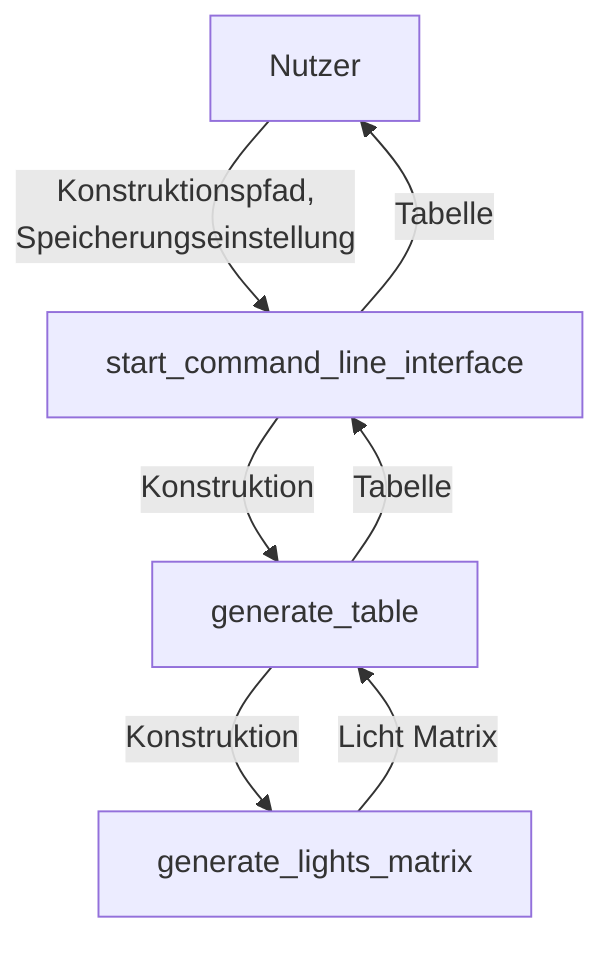

# Arukone

**Team-ID:** ==XYZ==  
**Autor:** Jonas B  
**Datum:** 26. Oktober 2023

## Inhaltsverzeichnis

1. [Lösungsidee](#lösungsidee)
2. [Umsetzung](#umsetzung)
3. [Beispiele](#beispiele)
4. [Quelltext](#quelltext)

## Lösungsidee

Das Programm soll aus einem Konstruktionsplan eine Tabelle erstellen, die angibt, welche ausgewählten LEDs der letzten Reihe an Bauteilen in Abhängigkeit von dem Status der einzelnen Lampen am Anfang leuchten.

Um das herauszufinden, kann jede einzelne Kombination aus Lampen einzeln betrachtet werden.

Der Status der ersten Reihe Lampen ist bekannt. Jede Reihe modifiziert den Status der vorangegangenen Reihe. Daher kann man über die einzelnen Reihen iterieren und jedes Mal die einzelnen Statuse entsprechend der Eigenschaften der Bauteile anpassen, bis die letzte Reihe erreicht wird. 

Die Werte der ausgewählten LEDs können nun abgelesen und in die Tabelle eingetragen werden.

## Umsetzung

Die Lösungsidee wird in Python implementiert.

*Flowchart des Programms*

## Beispiele

## Quelltext

