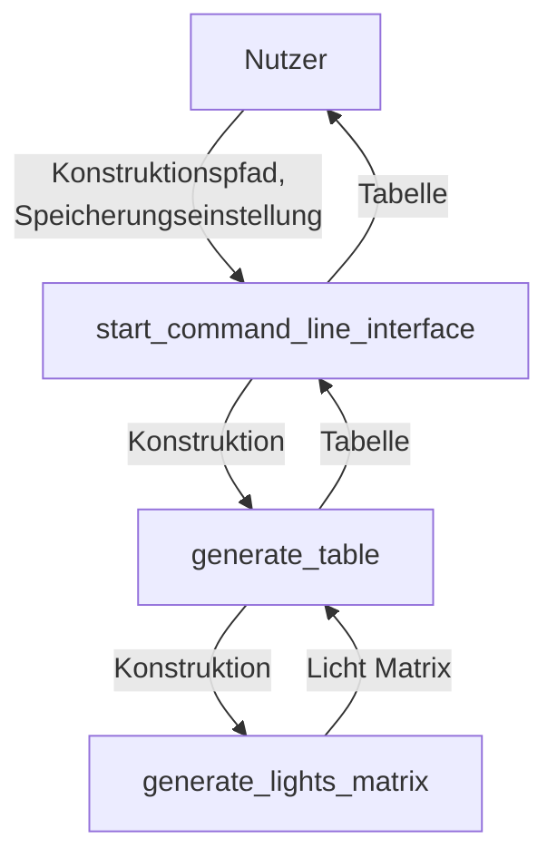

# Arukone

**Team-ID:** ==XYZ== <br>
**Autor:** Jonas B <br>
**Datum:** 26. Oktober 2023

## Inhaltsverzeichnis

1. [Lösungsidee](#lösungsidee)
2. [Umsetzung](#umsetzung)
3. [Beispiele](#beispiele)
4. [Quelltext](#quelltext)

## Lösungsidee

Das Programm soll aus einem Konstruktionsplan eine Tabelle erstellen, die angibt, welche ausgewählten LEDs der letzten Reihe an Bauteilen in Abhängigkeit von dem Zustand (an/aus) der einzelnen Lampen am Anfang leuchten.

Um das herauszufinden, kann jede einzelne Kombination an Lampen einzeln betrachtet werden.

Der Zustand der ersten Reihe Lampen ist bekannt. Jede Reihe modifiziert den Zustand der vorangegangenen Reihe. Daher kann man über die einzelnen Reihen iterieren und jedes Mal die einzelnen Zustande entsprechend der Eigenschaften der Bauteile anpassen, bis die letzte Reihe erreicht wird. 

Die Werte der ausgewählten LEDs können nun abgelesen und in die Tabelle eingetragen werden. Der Prozess wird für alle Lampenkombinationen wiederholt, um die Tabelle zu vervollständigen.

## Umsetzung

Die Lösungsidee wird in Python implementiert.


*Flowchart des Programms*

Beim Ausführen der Datei main.py läuft die Funktion `start_commmand_line_interface`. Sie fragt den Nutzer nach dem Pfad der Konstruktion und ob die Tabelle als Datei gespeichert werden soll oder nur in der Konsole ausgegeben. Falls Speichern gewählt wurde, fragt das Programm zusätzlich den Speicherpfad ab.

Danach wird die Konstruktionsdatei eingelesen. Mithilfe von Regex werden die Dimensionen der Konstruktion übersprungen. Der Rest wird in eine Liste eingelesen. Die Liste wird an die Funktion `generate_table` weitergegeben. Die generierte Tabelle wird entweder gespeichert oder in der Konsole ausgegeben.

Die Funktion `generate_table` bestimmt zuerst die Lampen indem sie Elemente, die mit `Q` anfangen, aus der ersten Zeile der Konstruktion extrahiert. Danach generiert sie alle Möglichen Kombinationen an Zustanden der Lampen.

Für jede Kombination wird eine Lichtmatrix mithilfe der Funktion `generate_lights_matrix` erstellt. Sie enthält den Zustand jedes einzelnen Feldes. Der Lichtmatrix werden die Zustande der ausgewählten LEDs entnommen. Die Zustande der Lampen und der LEDs bilden eine Reihe der Tabelle. Die Tabelle wird mithilfe der Packets `prettytable` erstellt.

Die Funktion `generate_lights_matrix` iteriert über jedes Element der Konstruktion. Sie ersetzt die Beschreiben des Feldes mit ihrem Zustand, indem sie den Zustand der Felder in der vorangegangenen Reihe verändern. Wenn der Zustand eines Feldes den Zustand zweier Felder verändert, wie das bei roten und weißen Bauteilen der Fal ist, werden beide Felder gleichzeitig geändert. Die nächste Iteration wird dann übersprungen.

## Beispiele

### Nandu 1

```
user@computer 4. Nandu % python3 main.py
Path to construction: examples/Nandu 1/nandu1.txt
Save table to disk (yes/no): no
+-----+-----+-----+-----+
|  Q1 |  Q2 |  L1 |  L2 |
+-----+-----+-----+-----+
| Off | Off |  On |  On |
| Off |  On |  On |  On |
|  On | Off |  On |  On |
|  On |  On | Off | Off |
+-----+-----+-----+-----+
```

### Nandu 2

```
user@computer 4. Nandu % python3 main.py
Path to construction: examples/Nandu 2/nandu2.txt
Save table to disk (yes/no): no
+-----+-----+-----+-----+
|  Q1 |  Q2 |  L1 |  L2 |
+-----+-----+-----+-----+
| Off | Off | Off |  On |
| Off |  On | Off |  On |
|  On | Off | Off |  On |
|  On |  On |  On | Off |
+-----+-----+-----+-----+
```

### Nandu 3

```
user@computer 4. Nandu % python3 main.py
Path to construction: examples/Nandu 3/nandu3.txt
Save table to disk (yes/no): no
+-----+-----+-----+-----+-----+-----+-----+
|  Q1 |  Q2 |  Q3 |  L1 |  L2 |  L3 |  L4 |
+-----+-----+-----+-----+-----+-----+-----+
| Off | Off | Off |  On | Off | Off |  On |
| Off | Off |  On |  On | Off | Off | Off |
| Off |  On | Off |  On | Off |  On |  On |
| Off |  On |  On |  On | Off |  On | Off |
|  On | Off | Off | Off |  On | Off |  On |
|  On | Off |  On | Off |  On | Off | Off |
|  On |  On | Off | Off |  On |  On |  On |
|  On |  On |  On | Off |  On |  On | Off |
+-----+-----+-----+-----+-----+-----+-----+
```

### Nandu 3

```
user@computer 4. Nandu % python3 main.py
Path to construction: examples/Nandu 4/nandu4.txt            
Save table to disk (yes/no): no
+-----+-----+-----+-----+-----+-----+
|  Q1 |  Q2 |  Q3 |  Q4 |  L1 |  L2 |
+-----+-----+-----+-----+-----+-----+
| Off | Off | Off | Off | Off | Off |
| Off | Off | Off |  On | Off | Off |
| Off | Off |  On | Off | Off |  On |
| Off | Off |  On |  On | Off | Off |
| Off |  On | Off | Off |  On | Off |
| Off |  On | Off |  On |  On | Off |
| Off |  On |  On | Off |  On |  On |
| Off |  On |  On |  On |  On | Off |
|  On | Off | Off | Off | Off | Off |
|  On | Off | Off |  On | Off | Off |
|  On | Off |  On | Off | Off |  On |
|  On | Off |  On |  On | Off | Off |
|  On |  On | Off | Off | Off | Off |
|  On |  On | Off |  On | Off | Off |
|  On |  On |  On | Off | Off |  On |
|  On |  On |  On |  On | Off | Off |
+-----+-----+-----+-----+-----+-----+
```

### Nandu 5

```
user@computer 4. Nandu % python3 main.py
Path to construction: examples/Nandu 5/nandu5.txt
Save table to disk (yes/no): no
+-----+-----+-----+-----+-----+-----+-----+-----+-----+-----+-----+
|  Q1 |  Q2 |  Q3 |  Q4 |  Q5 |  Q6 |  L1 |  L2 |  L3 |  L4 |  L5 |
+-----+-----+-----+-----+-----+-----+-----+-----+-----+-----+-----+
| Off | Off | Off | Off | Off | Off | Off | Off | Off |  On | Off |
| Off | Off | Off | Off | Off |  On | Off | Off | Off |  On | Off |
| Off | Off | Off | Off |  On | Off | Off | Off | Off |  On |  On |
| Off | Off | Off | Off |  On |  On | Off | Off | Off |  On |  On |
| Off | Off | Off |  On | Off | Off | Off | Off |  On | Off | Off |
| Off | Off | Off |  On | Off |  On | Off | Off |  On | Off | Off |
| Off | Off | Off |  On |  On | Off | Off | Off | Off |  On |  On |
| Off | Off | Off |  On |  On |  On | Off | Off | Off |  On |  On |
| Off | Off |  On | Off | Off | Off | Off | Off | Off |  On | Off |
| Off | Off |  On | Off | Off |  On | Off | Off | Off |  On | Off |
| Off | Off |  On | Off |  On | Off | Off | Off | Off |  On |  On |
| Off | Off |  On | Off |  On |  On | Off | Off | Off |  On |  On |
| Off | Off |  On |  On | Off | Off | Off | Off |  On | Off | Off |
| Off | Off |  On |  On | Off |  On | Off | Off |  On | Off | Off |
| Off | Off |  On |  On |  On | Off | Off | Off | Off |  On |  On |
| Off | Off |  On |  On |  On |  On | Off | Off | Off |  On |  On |
| Off |  On | Off | Off | Off | Off | Off | Off | Off |  On | Off |
| Off |  On | Off | Off | Off |  On | Off | Off | Off |  On | Off |
| Off |  On | Off | Off |  On | Off | Off | Off | Off |  On |  On |
| Off |  On | Off | Off |  On |  On | Off | Off | Off |  On |  On |
| Off |  On | Off |  On | Off | Off | Off | Off |  On | Off | Off |
| Off |  On | Off |  On | Off |  On | Off | Off |  On | Off | Off |
| Off |  On | Off |  On |  On | Off | Off | Off | Off |  On |  On |
| Off |  On | Off |  On |  On |  On | Off | Off | Off |  On |  On |
| Off |  On |  On | Off | Off | Off | Off | Off | Off |  On | Off |
| Off |  On |  On | Off | Off |  On | Off | Off | Off |  On | Off |
| Off |  On |  On | Off |  On | Off | Off | Off | Off |  On |  On |
| Off |  On |  On | Off |  On |  On | Off | Off | Off |  On |  On |
| Off |  On |  On |  On | Off | Off | Off | Off |  On | Off | Off |
| Off |  On |  On |  On | Off |  On | Off | Off |  On | Off | Off |
| Off |  On |  On |  On |  On | Off | Off | Off | Off |  On |  On |
| Off |  On |  On |  On |  On |  On | Off | Off | Off |  On |  On |
|  On | Off | Off | Off | Off | Off |  On | Off | Off |  On | Off |
|  On | Off | Off | Off | Off |  On |  On | Off | Off |  On | Off |
|  On | Off | Off | Off |  On | Off |  On | Off | Off |  On |  On |
|  On | Off | Off | Off |  On |  On |  On | Off | Off |  On |  On |
|  On | Off | Off |  On | Off | Off |  On | Off |  On | Off | Off |
|  On | Off | Off |  On | Off |  On |  On | Off |  On | Off | Off |
|  On | Off | Off |  On |  On | Off |  On | Off | Off |  On |  On |
|  On | Off | Off |  On |  On |  On |  On | Off | Off |  On |  On |
|  On | Off |  On | Off | Off | Off |  On | Off | Off |  On | Off |
|  On | Off |  On | Off | Off |  On |  On | Off | Off |  On | Off |
|  On | Off |  On | Off |  On | Off |  On | Off | Off |  On |  On |
|  On | Off |  On | Off |  On |  On |  On | Off | Off |  On |  On |
|  On | Off |  On |  On | Off | Off |  On | Off |  On | Off | Off |
|  On | Off |  On |  On | Off |  On |  On | Off |  On | Off | Off |
|  On | Off |  On |  On |  On | Off |  On | Off | Off |  On |  On |
|  On | Off |  On |  On |  On |  On |  On | Off | Off |  On |  On |
|  On |  On | Off | Off | Off | Off |  On | Off | Off |  On | Off |
|  On |  On | Off | Off | Off |  On |  On | Off | Off |  On | Off |
|  On |  On | Off | Off |  On | Off |  On | Off | Off |  On |  On |
|  On |  On | Off | Off |  On |  On |  On | Off | Off |  On |  On |
|  On |  On | Off |  On | Off | Off |  On | Off |  On | Off | Off |
|  On |  On | Off |  On | Off |  On |  On | Off |  On | Off | Off |
|  On |  On | Off |  On |  On | Off |  On | Off | Off |  On |  On |
|  On |  On | Off |  On |  On |  On |  On | Off | Off |  On |  On |
|  On |  On |  On | Off | Off | Off |  On | Off | Off |  On | Off |
|  On |  On |  On | Off | Off |  On |  On | Off | Off |  On | Off |
|  On |  On |  On | Off |  On | Off |  On | Off | Off |  On |  On |
|  On |  On |  On | Off |  On |  On |  On | Off | Off |  On |  On |
|  On |  On |  On |  On | Off | Off |  On | Off |  On | Off | Off |
|  On |  On |  On |  On | Off |  On |  On | Off |  On | Off | Off |
|  On |  On |  On |  On |  On | Off |  On | Off | Off |  On |  On |
|  On |  On |  On |  On |  On |  On |  On | Off | Off |  On |  On |
+-----+-----+-----+-----+-----+-----+-----+-----+-----+-----+-----+
```

## Quelltext

Das Programm besteht aus 3 Funktionen:

- `start_command_line_interface()` — Fragt den Nutzer nach dem Konstruktionspfad und ob und wie die Tabelle gespeichert werden soll. Speichert entweder die Tabelle oder gibt sie in die Konsole aus.
- `generate_table(construction: list) -> str` — Erstellt eine Texttabelle von einer Konstruktionsliste, die den Zustand der gewünschten LEDs in Abhängigkeit an die initialen Lampen zeigt.
- `generate_lights_matrix(construction: list, lamps: dict) -> list` — Erstellt eine 2d Liste die beschreibt, welche Felder erleuchtet.
