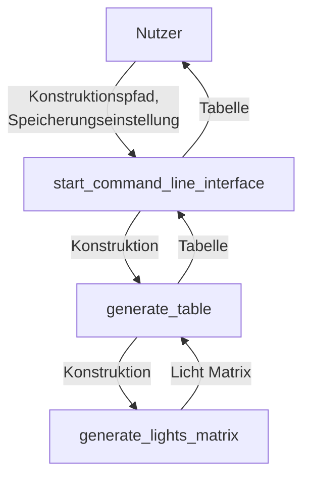

# Arukone

**Team-ID:** ==XYZ==  
**Autor:** Jonas B  
**Datum:** 26. Oktober 2023

## Inhaltsverzeichnis

1. [Lösungsidee](#lösungsidee)
2. [Umsetzung](#umsetzung)
3. [Beispiele](#beispiele)

## Lösungsidee

Das Programm erstellt zufällig aufgebaute Arukino-Puzzel. Danach überprüft es, ob das Arukino lösbar ist. Der Prozess wird so lange wiederholt, bis ein lösbares Arukino-Puzzel entsteht und es ausgegeben wird.

## Umsetzung

Die Lösungsidee wird in Python implementiert.

## Beispiele

## Quelltext

